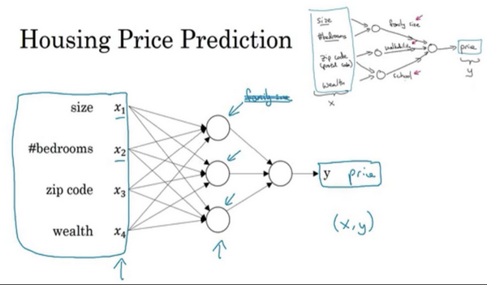

###1.2 什么是神经网络？(What is a Neural Network)
这一讲通过一个 Housing Price Prediction 的例子，讲解了关于神经网络的基础知识。

下图1是一个最简单的只有一个神经元的神经网络，通过输入房屋面积 x，通过一个节点（神经元neuron），输出预测房屋价格 y。而这个neuron这里，我们使用的激活函数是**ReLU**，它的全称是**Rectified Linear Unit**。rectify（修正）可以理解成max(0,x)，这也是得到一个这种形状的函数的原因。

这时候如果我们不仅仅用房屋的面积来预测它的价格，还想使用一些有关房屋的其它特征，比如卧室的数量，或许有一个很重要的因素，一家人的数量也会影响房屋价格，这个房屋能住下一家人或者是四五个人的家庭吗？而这确实是基于房屋大小，以及真正决定一栋房子是否能适合你们家庭人数的卧室数。再或者说，邮政编码或许能作为一个特征，告诉你步行化程度。比如这附近是不是高度步行化，你是否能步行去杂货店或者是学校，以及你是否需要驾驶汽车。有些人喜欢居住在以步行为主的区域，另外根据邮政编码还和富裕程度相关（在美国是这样的）。但在其它国家也可能体现出附近学校的教育水平有多好。

所以让我们再来用多一些的相关特征作为输入x_i,如下图2。

这里有四个输入的神经网络，这输入的特征有房屋的大小、卧室的数量、邮政编码和区域的富裕程度。给出这些输入的特征之后，神经网络的工作就是预测对应的价格。同时也注意到这些被叫做隐藏单元圆圈（中间的3个neuron），在一个神经网络中，它们每个都从输入的四个特征获得自身输入，比如说，hidden layer第一个节点代表家庭人口，而家庭人口仅仅取决于x_1和x_2特征，换句话说，在神经网络中，你决定在这个节点中想要得到什么，然后用所有的四个输入乘上各自权重weights来计算想要得到的。因此，我们说 input layer 和 hidden layer 被紧密的连接起来了。

用一个更general的图来表示神经网络，可以用下图3和下图4。图3表示一个 hidden layer 的神经元，图4表示一个基础的神经网络。

这里的最右边的 a 就代表了 housing price prediction 图2中 hidden layer 的其中一个节点。

图4中绿色节点表示特征输入x，蓝色部分hidden layer，橙色部分表是输出的预测结果。
神经网络给予了足够多的关于x和y的数据，给予了足够的训练样本有关x和y，它非常擅长计算从x到y的精准映射函数。而找到了最合适的函数，我们就可以通过输入特征x，得到预测结果y，用它来完成很多任务。

