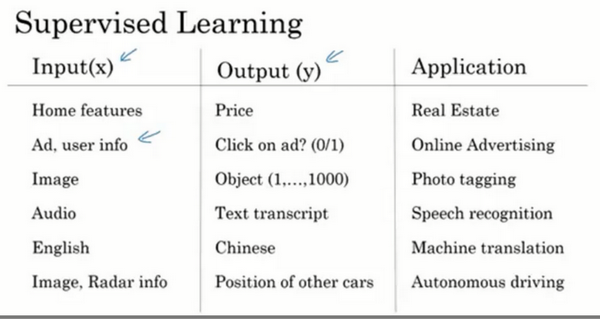

### 1.3 神经网络的监督学习(Supervised Learning with Neural Networks)

神经网络有很多的种类，从使用效果来讲，有些使用起来就恰到好处，但事实表明，到目前几乎所有由神经网络创造的经济价值，本质上都离不开一种叫做监督学习的机器学习类别.

#### 神经网络应用
如下图1所示，有一些例子来说明神经网络已经被高效应用到很多地方，而大多数这些应用本质上就是一种监督性学习，不能说每一个应用一定是用监督性学习的方法，但是下图每一类应用都可以并推荐使用神经网络的监督性学习方法，得到预测结果。

1. 房价预测。通过输入有关房屋的一些特征，用神经网络来学习一系列函数来映射到一些输出从而预测价格y。
2. 在线广告。该应用使用神经网络根据你在网站上输入的信息（搜索记录，浏览记录等）以及用户的一些其他信息来选择性地向你展示你最有可能点开的广告，这是当下非常有利可图的一个应用。同时，这种能力也直接冲击了很多大型线上广告商的利益底线。
3. 计算机视觉。通过神经网络，将1000种图片特征输入，并且每张图片得到一个索引，如果索引范围是1-1000，那每个索引都代表一种图片。也许会用它来标记图片类别，方便图片管理。
4. 语音识别。将语音片段提取特征，将其输入神经网络，让它输出文本记录。
5. 机器翻译。利用神经网络输入英语句子，接着输出一个中文句子。
6. 自动驾驶。在自动驾驶技术中，输入一幅图像，就好像一个信息雷达展示汽车前方有什么，据此，你可以训练一个神经网络，来告诉汽车在马路上面具体的位置，这就是神经网络在自动驾驶系统中的一个关键成分。

而适合每一个不同的应用的神经网络模型也会有差别。

比如，对于房地产和在线广告来说可能是用相对的标准一些的神经网络。对于图像应用，我们经常在神经网络上使用卷积（**Convolutional Neural Network**），通常缩写为**CNN**。对于序列数据，例如音频，有一个时间组件，随着时间的推移，音频被播放出来，所以音频是最自然的表现。作为一维时间序列（两种英文说法**one-dimensional time series / temporal sequence**）.对于序列数据，经常使用**RNN**，一种递归神经网络（**Recurrent Neural Network**），语言，英语和汉语字母表或单词都是逐个出现的，所以语言也是最自然的序列数据，因此更复杂的**RNNs**版本经常用于这些应用。对于更复杂的应用比如自动驾驶，你有一张图片，可能会显示更多的**CNN**卷积神经网络结构，其中的雷达信息是完全不同的，你可能会有一个更定制的，或者一些更复杂的混合的神经网络结构。

####结构化数据 vs 非结构化数据

神经网络算法对于结构化和非结构化数据都有用处。

结构化数据意味着数据的基本数据库。例如在房价预测中，有一个数据库，其中几列数据告诉你卧室的大小和数量，这就是结构化数据。或预测用户是否会点击广告，可能会得到关于用户的信息，比如年龄以及关于广告的一些信息，然后对你的预测分类标注，这就是结构化数据。

非结构化数据是指比如音频，原始音频或者是想要识别的图像或文本中的内容。这里的特征可能是图像中的像素值或文本中的单个单词。

